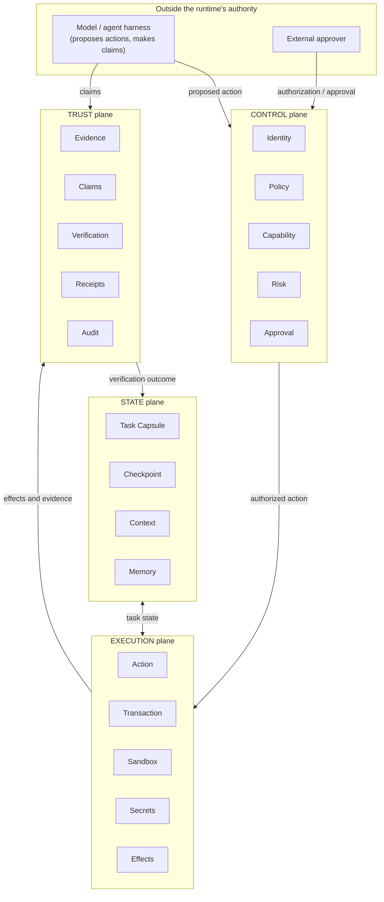
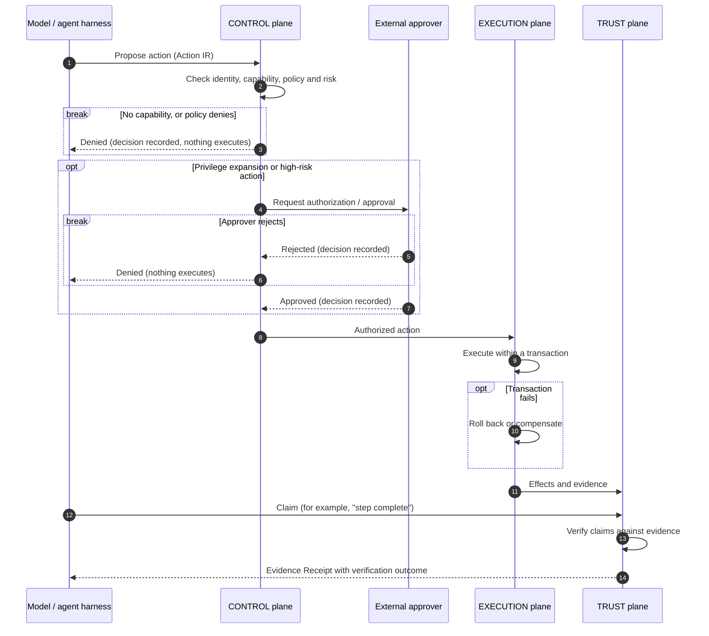

# Architecture Overview

> **Status: pre-alpha, Phase 0.** This document explains the intended
> architecture. Nothing described here is implemented, and protocol fields
> are not defined.
>
> This is an explanatory document. The authoritative sources are
> [ARCHITECTURE.md](../../ARCHITECTURE.md) (entry point),
> [ADR 0001](../adr/0001-architecture-freeze.md) (decision record, status:
> Proposed) and [docs/invariants.md](../invariants.md) (invariants).
> Unresolved decisions are listed in
> [ADR 0001 § Open questions](../adr/0001-architecture-freeze.md#open-questions).

## Purpose

Proof Runtime is vendor-neutral execution and trust infrastructure for AI
agents. It provides portable task state, explicit capabilities, governed
execution, evidence-backed verification and recovery across models and hosts.

"Proof" means evidence-backed, machine-verifiable execution records. It does
not mean formal correctness proofs for arbitrary AI outputs.

## Actors and boundaries

This document uses descriptive terms such as **model / agent harness**,
**host**, **principal**, **external approver**, **verifier**, **control
point** and **enforcement boundary**. They are **not** new architectural
primitives. Their working definitions are in
[ADR 0001 § Terms identified for review](../adr/0001-architecture-freeze.md#terms-identified-for-review).

## The four planes

The diagram shows responsibilities and the main direction of information
flow. It does not prescribe deployment topology or process boundaries.

### CONTROL plane

Decides **whether** an action may happen.

- **Identity**: who or what is acting, and on whose behalf.
- **Policy**: rules that permit, deny or constrain actions.
- **Capability**: explicit, scoped permissions held by an actor, expressed
  through the Capability Manifest protocol.
- **Risk**: classification of a proposed action's potential impact.
- **Approval**: authorization from an external approver, where policy or risk
  requires it.

The model does not participate in CONTROL decisions as an authority
(`MODEL != AUTHORITY`). Content in STATE never acts as policy
(`MEMORY != POLICY`).

### EXECUTION plane

Carries out **authorized** actions and contains their effects.

- **Action**: a proposed or authorized operation, expressed through the
  Action IR protocol.
- **Transaction**: a unit of execution whose failure leads to rollback or
  compensation.
- **Sandbox**: an isolated environment that bounds effects, where the
  integration grade allows.
- **Secrets**: credentials made available to authorized actions. Raw secret
  values never appear in protocol documents. How secrets are supplied, and
  kept out of model-visible context, is an open question (OQ-13).
- **Effects**: the observable changes an action makes, recorded as evidence.

### STATE plane

Holds **what the task is and where it stands**.

- **Task Capsule**: a portable representation of a task and its state,
  intended to move between models and hosts.
- **Checkpoint**: a recoverable snapshot of task state.
- **Context**: information supplied to a model for a step of work.
- **Memory**: information retained across steps or tasks.

STATE is informational. It does not grant authority and does not establish
verified facts on its own.

### TRUST plane

Establishes **what actually happened** and **what can be believed**.

- **Evidence**: records collected during execution, with provenance.
- **Claims**: assertions made by models, tools or hosts, kept separate from
  verified facts.
- **Verification**: evaluation of claims against evidence.
- **Receipts**: verifiable records of execution, evidence and verification
  outcomes, expressed through the Evidence Receipt protocol.
- **Audit**: a durable record of decisions, actions and outcomes, for later
  review.

The four core protocols are named alongside the components they express
above. Their intended roles, requirements and blocking questions are in
[spec/README.md](../../spec/README.md).

## Action lifecycle

The following flow shows how a proposed action is handled. It describes
intended behavior, not an implemented API.

In the diagram, a `break` block marks a point where the flow **ends**:
nothing after it happens for that action.

Notes on the flow:

1. If there is no capability, or policy denies, the denial is recorded and
   nothing executes.
2. A request that needs external authorization or approval has two
   outcomes, and both are recorded. **Approved** continues to execution.
   **Rejected** ends the flow; the action never reaches the EXECUTION plane.
3. A model's claim never changes task status to verified by itself. Only a
   verification outcome in the TRUST plane can do that, and only when
   evidence supports the claim. The set of possible verification outcomes
   is not yet defined (OQ-17).
4. Rollback or compensation, and whether it succeeded, are part of the
   evidence.

### Task completion

The lifecycle states and transitions of a task are **not yet defined**
(OQ-14). One constraint is fixed now: a model may claim that a task is
complete, but **a model must never directly transition an executing task to
verified completion**. That transition requires a verification outcome from
the TRUST plane, backed by evidence.

## Integration grades

The runtime can be integrated with a host at three grades. Each grade
defines an **enforcement boundary**: the region within which the runtime can
actually prevent or constrain behavior. The runtime never claims an
enforcement guarantee outside that boundary (`HOST SUPPORT != ENFORCEMENT`).
The table describes design intent; nothing is implemented yet.

| Grade          | Who executes actions                                                 | What the runtime is designed to do                                                                                                                                                                         | What it does not guarantee                                                                                                                                                                                     |
| -------------- | -------------------------------------------------------------------- | ---------------------------------------------------------------------------------------------------------------------------------------------------------------------------------------------------------- | -------------------------------------------------------------------------------------------------------------------------------------------------------------------------------------------------------------- |
| **Observer**   | The host, without consulting the runtime                             | Record the reports it receives and what it can independently observe. Evaluate claims against that evidence.                                                                                              | That any action was authorized, prevented or contained. That host reports are complete or accurate; they are host-attested.                                                                                   |
| **Integrated** | The host, consulting the runtime through control points it exposes   | Issue and record decisions. Enforce those decisions through the specific control points the host exposes, for the operations that pass through them. Evaluate claims against the evidence it receives.   | Mediation of operations that do not pass through those control points. Whether all relevant operations pass through them depends on the host, not the runtime. Host behavior outside those points is host-attested at most. |
| **Managed**    | The runtime, inside an execution boundary it controls                | Enforce capability, policy and approval decisions for actions inside that boundary.                                                                                                                       | Anything that happens outside that boundary.                                                                                                                                                                  |

Consequences:

- Records must identify the integration grade and the actual enforcement
  boundary under which each action ran. For the Integrated grade, they must
  also identify which control points were in effect. Then a consumer of an
  Evidence Receipt can tell enforced facts apart from observed or attested
  ones. How this is encoded is an open question (OQ-21).
- Evidence supplied by a host is host-attested. It is not runtime-observed,
  and it is weighed as such (`TOOL OUTPUT != TRUSTED FACT`).
- Moving a task between hosts can change its integration grade. How a Task
  Capsule handles that change is an open question (OQ-16).

## Recovery

Recovery uses the STATE and TRUST planes together:

- **Checkpoints** let a task resume from a known state, possibly on a
  different model or host.
- **Evidence and receipts** show which steps actually completed and were
  verified. Those steps do not need to be re-executed or re-trusted.
- **Rollback or compensation** handles the effects of failed transactions.

The exact recovery semantics are open questions (OQ-11, OQ-16).

## Non-goals

- Formal correctness proofs of arbitrary model outputs.
- Replacing model providers, agent harnesses or hosts.
- Enforcement beyond the boundary the runtime controls.
- Industry-specific semantics in the core protocols. Domain-specific
  behavior is expected to live in extensions.
