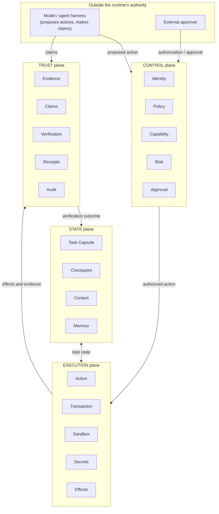
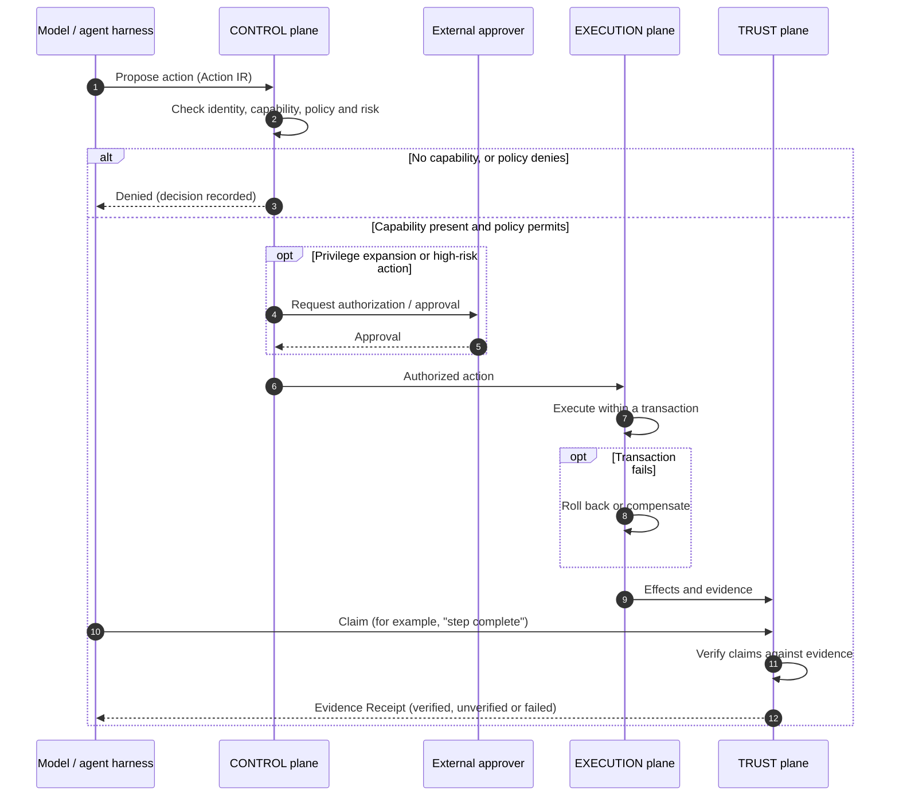

# Architecture Overview

> **Status: pre-alpha, Phase 0.** This document describes the intended
> architecture. Nothing described here is implemented. Protocol fields are
> not defined. Unresolved decisions are listed in
> [ADR 0001](../adr/0001-architecture-freeze.md#open-questions).

## Purpose

Proof Runtime is vendor-neutral execution and trust infrastructure for AI
agents. It provides portable task state, explicit capabilities, governed
execution, evidence-backed verification and recovery across models and hosts.

"Proof" means evidence-backed, machine-verifiable execution records. It does
not mean formal correctness proofs for arbitrary AI outputs.

## Actors and boundaries

The following descriptive terms are used in this document. They are **not**
new architectural primitives; they are listed for review in
[ADR 0001](../adr/0001-architecture-freeze.md#terms-identified-for-review).

- **Model**: any AI model producing proposals and claims. Treated as
  untrusted for authority (see [invariants](../invariants.md)).
- **Agent harness**: the software that drives a model in a loop and turns its
  output into proposed actions.
- **Host**: the environment in which actions take effect (for example, a
  developer machine, a CI system, or a cloud service).
- **Principal**: a human or system identity on whose behalf, or with whose
  authority, a task runs.
- **External approver**: a principal outside the requesting actor who can
  authorize privilege expansion or approve high-risk actions.
- **Verifier**: the TRUST-plane function that evaluates claims against
  evidence.

## The four planes

The diagram shows responsibilities and the main direction of information
flow. It does not prescribe deployment topology or process boundaries.

### CONTROL plane

Decides **whether** an action may happen.

- **Identity**: who or what is acting, and on whose behalf.
- **Policy**: rules that permit, deny or constrain actions.
- **Capability**: explicit, scoped permissions held by an actor, expressed
  through the Capability Manifest protocol.
- **Risk**: classification of a proposed action's potential impact.
- **Approval**: authorization from an external approver, where policy or risk
  requires it.

The model does not participate in CONTROL decisions as an authority
(`MODEL != AUTHORITY`). Content in STATE never acts as policy
(`MEMORY != POLICY`).

### EXECUTION plane

Carries out **authorized** actions and contains their effects.

- **Action**: a proposed or authorized operation, expressed through the
  Action IR protocol.
- **Transaction**: a unit of execution whose failure leads to rollback or
  compensation.
- **Sandbox**: an isolated environment that bounds effects, where the
  integration grade allows.
- **Secrets**: credentials made available to authorized actions. Whether and
  how secrets are kept out of model-visible context is an open question.
- **Effects**: the observable changes an action makes, recorded as evidence.

### STATE plane

Holds **what the task is and where it stands**.

- **Task Capsule**: a portable representation of a task and its state,
  intended to move between models and hosts.
- **Checkpoint**: a recoverable snapshot of task state.
- **Context**: information supplied to a model for a step of work.
- **Memory**: information retained across steps or tasks.

STATE is informational. It does not grant authority and does not establish
verified facts on its own.

### TRUST plane

Establishes **what actually happened** and **what can be believed**.

- **Evidence**: records collected during execution, with provenance.
- **Claims**: assertions made by models, tools or hosts, kept separate from
  verified facts.
- **Verification**: evaluation of claims against evidence.
- **Receipts**: verifiable records of execution, evidence and verification
  outcomes, expressed through the Evidence Receipt protocol.
- **Audit**: a durable record of decisions, actions and outcomes, for later
  review.

## Core protocols

| Protocol            | Primary plane | Intended role                                                                 |
| ------------------- | ------------- | ----------------------------------------------------------------------------- |
| Task Capsule        | STATE         | Portable task identity, goal and state, usable across models and hosts        |
| Action IR           | EXECUTION     | Host-neutral intermediate representation of a proposed action                 |
| Capability Manifest | CONTROL       | Explicit statement of the capabilities an actor holds and their scope         |
| Evidence Receipt    | TRUST         | Machine-verifiable record linking actions, evidence, claims and verification  |

All four must be **model-neutral**, **host-neutral**, **versioned** and
**extensible**. No fields are defined yet; see
[spec/README.md](../../spec/README.md).

## Action lifecycle

The following flow shows how a proposed action is handled. It describes
intended behavior, not an implemented API.

Notes on the flow:

1. A denied action is recorded and nothing executes.
2. If the external approver rejects the request, the action is treated as
   denied and does not proceed to execution. For brevity, the diagram does
   not show this branch.
3. A model's claim never changes task status to verified by itself. Only the
   verification outcome in the TRUST plane can do that, and only when
   evidence supports the claim.
4. Rollback or compensation, and whether it succeeded, are part of the
   evidence.

### Task completion

The lifecycle states and transitions of a task are **not yet defined** (see
the open questions). One constraint is fixed now: a model may claim
that a task is complete, but **a model must never directly transition an
executing task to verified completion**. That transition requires a
verification outcome from the TRUST plane, backed by evidence.

## Integration grades

The runtime can be integrated with a host at three grades. Each grade
defines an **enforcement boundary**: the region within which the runtime can
actually prevent or constrain behavior. The runtime never claims an
enforcement guarantee outside that boundary (`HOST SUPPORT != ENFORCEMENT`).

| Grade          | Who executes actions                                  | What the runtime can guarantee                                                                                                | What it cannot guarantee                                                                    |
| -------------- | ----------------------------------------------------- | ----------------------------------------------------------------------------------------------------------------------------- | ------------------------------------------------------------------------------------------- |
| **Observer**   | The host, without consulting the runtime              | Accurate recording of what it was told and what it independently observed; verification of claims against available evidence | That any action was authorized, prevented or contained                                      |
| **Integrated** | The host, after consulting the runtime for decisions  | That it issued and recorded its decisions; verification of claims against available evidence                                  | That the host honored the decisions; host compliance is attested by the host, not enforced  |
| **Managed**    | The runtime, inside an execution boundary it controls | Enforcement of capability, policy and approval decisions for actions inside that boundary                                     | Anything that happens outside that boundary                                                 |

Consequences:

- Records produced by the runtime should indicate the integration grade
  under which each action ran. That way, a consumer of an Evidence Receipt
  can tell enforced facts apart from observed or attested ones.
- Evidence supplied by a host is host-attested. It is not runtime-observed,
  and it is weighed as such (`TOOL OUTPUT != TRUSTED FACT`).
- Moving a task between hosts can change its integration grade. How a Task
  Capsule handles that change is an open question.

## Recovery

Recovery uses the STATE and TRUST planes together:

- **Checkpoints** let a task resume from a known state, possibly on a
  different model or host.
- **Evidence and receipts** show which steps actually completed and were
  verified. Those steps do not need to be re-executed or re-trusted.
- **Rollback or compensation** handles the effects of failed transactions.

The exact recovery semantics are open questions.

## Non-goals

- Formal correctness proofs of arbitrary model outputs.
- Replacing model providers, agent harnesses or hosts.
- Enforcement beyond the boundary the runtime controls.
- Industry-specific semantics in the core protocols. Domain-specific
  behavior is expected to live in extensions.
