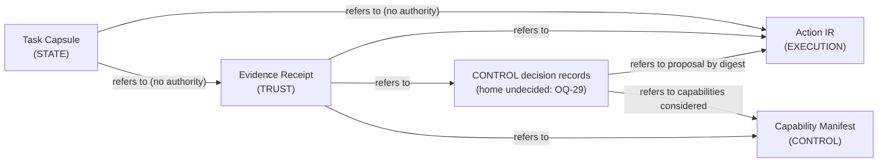

# Protocol Specification Dependency Map

> **Status: Proposed**, as part of
> [ADR 0002](../adr/0002-shared-protocol-foundations.md). It shows which
> open questions must be resolved before each core protocol can be
> specified at field level. OQ-1 to OQ-25 are defined in
> [ADR 0001](../adr/0001-architecture-freeze.md#open-questions). OQ-26 to
> OQ-29 are defined in
> [ADR 0002](../adr/0002-shared-protocol-foundations.md#new-open-questions).

## Shared foundations

These questions block **all four** protocols:

| Question | State |
|---|---|
| OQ-1, OQ-2, OQ-3, OQ-23 | Resolutions proposed in ADR 0002 (D1, D2, D3, D5). Still blocking until ADR 0002 is accepted. |
| OQ-4 | Canonicalization, digests and envelope choice proposed in ADR 0002 (D4). The signing residual (who signs, key management) does **not** block field-level specification, because signatures are carried outside documents (D4.5). It does block any claim of authenticity. |
| OQ-26 Identifier namespace | Open. Every document type identifier needs it (D2.2). |
| OQ-27 Resource limits | Open. Every protocol must state its limits (D1.4). |
| OQ-5 Identity model | Open. Every protocol names actors: the principal of a task, the proposer of an action, the holder of a capability, the producer of a receipt. |

## Per-protocol blockers

These come in addition to the shared foundations above.

| Protocol | Plane | Additional blocking questions | Why |
|---|---|---|---|
| **Capability Manifest** | CONTROL | OQ-6, OQ-7, OQ-8, OQ-9, OQ-10 | Capability scope and delegation (OQ-7) and the definition of "effectful" (OQ-10) shape what a capability covers. Risk (OQ-8) and approval (OQ-9) determine when a capability alone is insufficient (I9). Policy binding (OQ-6) determines how declarations feed decisions. |
| **Action IR** | EXECUTION | OQ-8, OQ-9, OQ-10, OQ-11, OQ-13, OQ-29 | An action must be classifiable for risk (OQ-8) and effect (OQ-10). It must be bindable to an approval (OQ-9) and to transaction boundaries (OQ-11). It must reference secrets without containing them (OQ-13, C12). How a CONTROL decision refers to it depends on OQ-29. |
| **Task Capsule** | STATE | OQ-13, OQ-14, OQ-15, OQ-16 | Portable state requires the lifecycle (OQ-14), the context/memory boundary (OQ-15), portability rules including change of grade (OQ-16), and secret-free state (OQ-13). |
| **Evidence Receipt** | TRUST | OQ-13, OQ-17, OQ-18, OQ-19, OQ-20, OQ-21, OQ-28, OQ-29 | It needs the outcome vocabulary and evidence categories (OQ-17, C10), verifier trust (OQ-18), retention and redaction (OQ-19), audit integrity (OQ-20) and recording of the grade and boundary (OQ-21). It must be secret-free (OQ-13), and may need trusted time (OQ-28). It must reference decision records (OQ-29). |

### Questions that block no protocol specification

| Question | Why it does not block |
|---|---|
| OQ-4 residual (signing) | Signatures are external to documents (D4.5). It blocks authenticity claims, not field design. |
| OQ-12 Sandbox requirements | Needed to *implement* the Managed grade, not to define documents. |
| OQ-22 Implementation language | Protocols are language-neutral. |
| OQ-24 Copyright, OQ-25 Security contact | Project governance. |

## Cross-protocol references

All references are by content digest (D4.3, C5). None of them conveys
authority (C6, C9).

The diagram shows reference direction only. It proposes no fields, and it
does not make decision records a fifth protocol.

## Recommended specification order

1. **Resolve the shared blockers:** accept ADR 0002, then decide OQ-26,
   OQ-27, OQ-5 and OQ-29.
2. **Specify Capability Manifest and Action IR together.** They share OQ-8,
   OQ-9 and OQ-10, and their definitions must agree on what a capability
   covers and what an action can do.
3. **Specify the Task Capsule**, once the lifecycle (OQ-14) is decided.
4. **Specify the Evidence Receipt last.** It references the other
   protocols and depends on the most TRUST-plane questions.

This order is a recommendation for review, not a decision.
